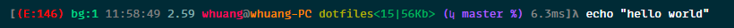

# weikinhuang's dotfiles

My `$SHELL`, mostly bash, works everywhere, `*nix`, `osx`, `wsl`.

## Installation

The bootstrap script will create symlinks in the home directory to the proper files. The script will also create `*.bak` files for backups of existing files.

### Install dotfiles with auto bootstrap

This will by default install dotfiles in the home directory with all options enabled

```bash
curl https://raw.githubusercontent.com/weikinhuang/dotfiles/master/bootstrap.sh | bash

# Additional arguments can be passed to the bootstrap script
curl https://raw.github...master/bootstrap.sh | bash -s -- [args]
```

### Install dotfiles with Git

You can clone the repository wherever you want, the home (`~/`) directory is recommended.

When the git repo is updated, the files will be automatically updated when the session is restarted.

```bash
# args can be passed to the bootstrap script
git clone https://github.com/weikinhuang/dotfiles.git ~/.dotfiles && ~/.dotfiles/bootstrap.sh
```

To update later on, just run `git pull` in `~/.dotfiles`.

### Install dotfiles without Git

To install or update without git installed, run:

```bash
cd; mkdir -p ~/.dotfiles \
  && curl -#L https://github.com/weikinhuang/dotfiles/tarball/master \
    | tar -C ~/.dotfiles -xzv --strip-components 1 \
  && ~/.dotfiles/bootstrap.sh
```

### `bootstrap.sh` args

| Arg          | Description                         |
| ------------ | ----------------------------------- |
| `--dir PATH` | Change the install directory        |
| `--no-git`   | Skip setting up `.gitconfig`        |
| `--no-vim`   | Skip setting up `.vimrc` and `.vim` |

## [Reference for aliases and functions](REFERENCE.md)

See [REFERENCE.md](REFERENCE.md) for all added commands, overrides, and changes to built-ins.

## [The Bash Prompt](PROMPT.md)

See [PROMPT.md](PROMPT.md) for configuration options.



## Configuration Options

To use these variables, export them to `~/.bash_local`.

```bash
# EXAMPLE
export DOT_AUTOLOAD_SSH_AGENT=1
```

| exported ENV var              | Set Value To | Description                                                                                        |
| ----------------------------- | ------------ | -------------------------------------------------------------------------------------------------- |
| `DOT_AUTOLOAD_SSH_AGENT`      | `1`          | Automatically start up ssh-agent when starting a new shell, and reuse any existing agent instances |
| `DOT_BASH_RESOLVE_PATHS`      | `1`          | Set bash option `set -o physical` to not resolve symlink paths                                     |
| `DOT_DISABLE_PREEXEC`         | `1`          | Disables loading [`bash-preexec.sh`](https://github.com/rcaloras/bash-preexec) functionality       |
| `DOT_INCLUDE_BREW_PATH`       | `1`          | Use to homebrew utilities without the `g` prefix (OSX)                                             |
| `DOT_INCLUDE_BUILTIN_PLUGINS` | `1`          | Loads files in dotfiles/plugins                                                                    |
| `DOT_SOLARIZED_DARK`          | `1`          | Use to tell common commands to use solarizeddark colors                                            |
| `DOT_SOLARIZED_LIGHT`         | `1`          | Use to tell common commands to use solarized light colors                                          |

## Custom hook points

### `~/.bash_local`

If `~/.bash_local` exists, it will be sourced before the built-ins are sourced. Env vars, configuration vars, and hooks can be placed in this file.

### `~/.bash_local.d/*.sh`

All files ending with `.sh` located in `~/.bash_local.d` will be loaded right after `~/.bash_local`, this is a good place to put include scripts that setup additional environments in separate files.

## .gitconfig.local

If a file `~/.gitconfig.local` exists, it will be sourced in addition to the built in git settings. Configurations in this file will be set with the highest priority.

## Plugins

Plugins are scripts that are loaded near the end of the dotfiles initialization process. They usually contain hooks, setup, or configuration for external programs.

See the [plugins/](./plugins/) directory for the built-in examples.

Plugins are also loaded from `~/.bash_local.d/` with any file ending in `.plugin`.

Example plugin for [`direnv`](https://direnv.net/):

```bash
# check if direnv exists
if ! command -v direnv &>/dev/null; then
  return
fi
# load direnv program hook
source <(direnv hook bash 2>/dev/null)
```

Specific plugins can be disabled with an environment variable: `DOT_PLUGIN_DISABLE_${PLUGIN_FILE_NAME}`.

Example disable direnv hook:

```bash
export DOT_PLUGIN_DISABLE_direnv=1
```

## Hooks

Hooks are available before and after each part of the dotfiles repo is loaded. This allows for customization between steps or overrides at point in time loading. They should be declared in `~/.bash_local` or `~/.bash_local.d/*.sh` so that they are available by the time the dotfiles are loaded.

Hook points are available before and after the steps:

- `exports`
- `functions`
- `aliases`
- `completion`
- `extra`
- `env`
- `post_local`
- `prompt`
- `plugins`

They can be declared as either a single function `dotfiles_hook_${HOOK}_{pre,post}` or pushed into the arrays `dotfiles_hook_${HOOK}_{pre,post}_functions`.

Example

```bash
# add a hook to run before the "functions" segment is loaded
function dotfiles_hook_functions_pre() {
    echo "I'm loading before functions"
    export FOO=123
}

# add a hook to run after the "alias" segment is loaded
function foobar() {
    echo "I'm loading after aliases"
    alias curl-help="curl --help"
}
# append to array
dotfiles_hook_alias_post_functions+=(foobar)
```

## [WSL configuration](utils/wsl/README.md)

Setup and configuration of Window's WSL is documented in [utils/wsl/README.md](utils/wsl/README.md).

## Development

You can try out this repo in `docker` easily to test your plugins or hooks.

```bash
$ docker run -it --rm -v "$(pwd):/root/.dotfiles:ro" -v "$HOME/.bash_local:/root/.bash_local:ro" -v "$HOME/.bash_local.d:/root/.bash_local.d:ro" ubuntu:latest bash
# OR with overrides set locally in the dotfiles repo
$ docker run -it --rm -v "$(pwd):/root/.dotfiles:ro" -v "$(pwd)/.bash_local:/root/.bash_local:ro" -v "$(pwd)/.bash_local.d:/root/.bash_local.d:ro" ubuntu:latest bash

# in the docker shell
$ (cd ~ && .dotfiles/bootstrap.sh)
# install any dependencies you might need, ex.
$ apt-get update && apt-get install -y --no-install-recommends curl git tar nodejs

# start a new shell with the dotfiles loaded, to reload, exit this shell and run this command again
$ env -i PS1=1 TERM="$TERM" PATH="$PATH" HOME="$HOME" SHELL="$SHELL" bash -l
$ CTRL+d
$ env -i PS1=1 TERM="$TERM" PATH="$PATH" HOME="$HOME" SHELL="$SHELL" bash -l
...
```

### shellcheck and shfmt

[`shellcheck`](https://github.com/koalaman/shellcheck) and [`shfmt`](https://github.com/mvdan/sh) are used to ensure consistency of the scripts in this repo. Files in `/external` are ignored, since they are external scripts.

```bash
# shellcheck
( git ls-files -z | xargs -0 grep -l 'shellcheck shell=\|^#!.\+sh'; git ls-files | grep '\.sh$' ) | grep -v '\.md$' | grep -v .gitlab-ci.yml | sort | uniq | xargs -n1 shellcheck -f gcc --source-path=SCRIPTDIR

# shfmt
( git ls-files -z | xargs -0 grep -l 'shellcheck shell=\|^#!.\+sh'; git ls-files | grep '\.sh$' ) | grep -v '\.md$' | grep -v .gitlab-ci.yml | sort | uniq | xargs -n1 shfmt -ln bash -ci -bn -i 2 -d -w
```
